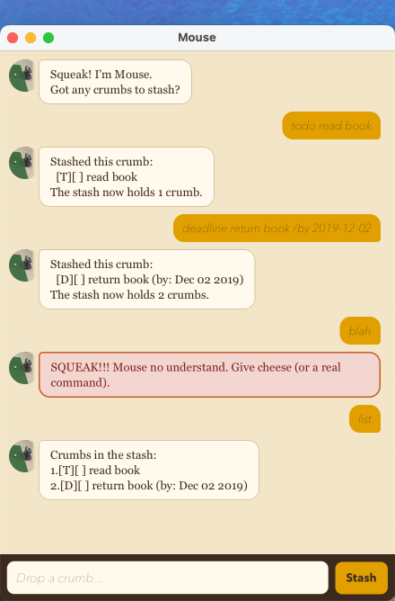

# Mouse

Mouse is a JavaFX chatbot that hoards to-dos, deadlines, and events.



## User guide

See the [Mouse User Guide](https://Sea1vester.github.io/ip/).

The Markdown source is [docs/README.md](docs/README.md).

## Run

Use **JDK 25** (Azul Zulu with JavaFX on Mac: `25.0.3.fx-zulu`).

```
./gradlew run
```

Or build and run the fat JAR:

```
./gradlew clean shadowJar
java -jar build/libs/mouse.jar
```

The CLI entry point is `mouse.Mouse`.
The JAR and `./gradlew run` start the GUI via `mouse.Launcher`.

Tasks are saved to `data/mouse.txt`.

## Credits

GUI scaffolding follows the [SE-EDU JavaFX tutorial](https://se-education.org/guides/tutorials/javaFx.html)
(Jeffry Lum and Damith C. Rajapakse).
See [CONTRIBUTORS.md](CONTRIBUTORS.md).
